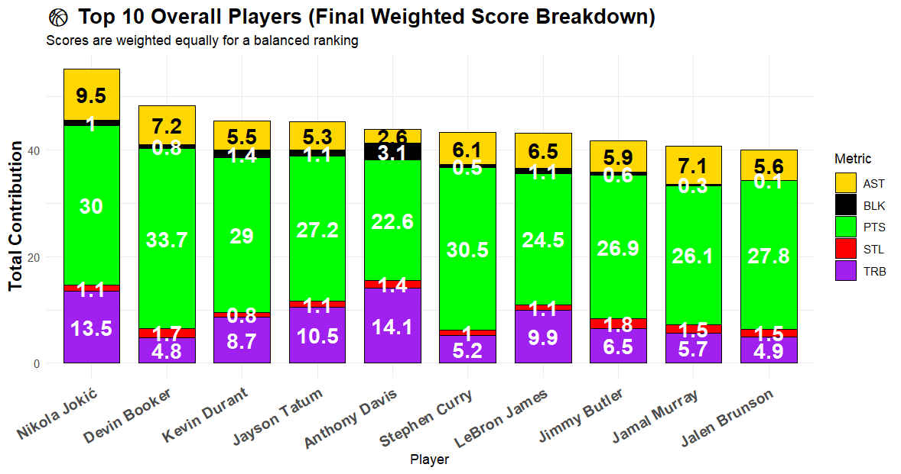

# NBA 2023 Playoff Player Performance Analysis

This project provides an in-depth analysis of NBA player performance during the **2023 NBA Playoffs**, with the goal of identifying the most impactful players using data-driven methods. Through **exploratory data analysis (EDA)**, **statistical analysis**, **correlation analysis**, **custom weighted scoring**, and **unsupervised learning** techniques, players are ranked and classified into performance tiers such as **Superstars, Starters, and Role Players**.

Key deliverables include clean data workflows, professional visualizations, and advanced segmentation using **PCA and KMeans clustering**. The analysis showcases the practical use of **data analytics** to extract insights in a **clear, visual, and actionable format**, demonstrating applied skills in statistical analysis, modeling, and performance evaluation.

### 🏀 Scoring Trends & Efficiency

- **Devin Booker** led all players with **33.7 PPG**, driven by **high-volume 2-point scoring** (10 made 2Ps/game), with limited reliance on 3-point shooting.
- **Stephen Curry** dominated from deep with **4.4 made 3s/game**, powering his **30.5 PPG** through elite perimeter accuracy.
- **Nikola Jokić** (30.0 PPG) and **Kevin Durant** (29.0 PPG) showcased **efficient 2-point production** — Jokić with **9.6 2Ps/game**, Durant combining **8.2 2Ps** and **8 FTs/game**, highlighting versatile and effective scoring methods.

> **Key Insight:** Players maximized **2-point efficiency**, **3-point shooting**, and **free throw impact** to elevate their scoring — revealing distinct offensive strengths despite limited midrange/inside shot breakdown.

### 🎯 Assist Efficiency & Playmaking

- **Nikola Jokić** led all players in assists with **9.5 AST/game**, paired with just **3.5 turnovers** — showcasing **elite efficiency** and exceptional court vision as a center.
- **James Harden** delivered **8.3 AST/game** with **3.2 TOV**, while **Devin Booker** provided **7.2 AST/game** and only **2.9 TOV**, highlighting **strong guard play** with **controlled turnovers**.

> **Key Insight:** Top performers not only generated high assist totals but maintained **low turnover rates**, underscoring their **decision-making** and **offensive leadership** throughout the playoffs.

### 🛡️ Defensive Standouts

- **Steals:**  
  - **Jimmy Butler** and **James Harden** led all players with **1.8 steals per game**, applying relentless defensive pressure while maintaining low foul rates.  
  - **Devin Booker** followed closely with **1.7 STL/game**, highlighting his two-way impact beyond scoring.

- **Blocks:**  
  - **Anthony Davis** dominated with **3.1 blocks per game** while committing just **2.9 personal fouls**, showcasing elite interior defense and discipline.  
  - **Joel Embiid** contributed **2.8 BLK/game**, reinforcing his role as a strong rim protector.

> **Key Insight:** Top defenders combined **high impact** with **low fouling**, maximizing efficiency without sacrificing minutes.

> **Bonus:** **Anthony Davis** was the **only player** in the top 10 for both **steals and blocks**, demonstrating rare versatility as both an **interior anchor** and **perimeter defender**.

### 🏀 Rebounding Leaders

- **Anthony Davis** led all players with **14.1 total rebounds per game**, dominating on the **defensive end** with **11.7 DRB/game**.
- **Nikola Jokić** secured **13.5 TRB/game**, balancing **10 DRB** with **3.5 ORB/game**, contributing across both ends.
- **Kevon Looney** was the **top offensive rebounder** with **4.7 ORB/game**, excelling in creating second-chance scoring opportunities.
- **Mitchell Robinson** also stood out with **5.0 ORB/game**, reinforcing his role as a **specialist in offensive rebounding**.

> **Key Insight:** Rebounding impact varied by role — **Davis and Jokić** dominated **overall**, while **Looney and Robinson** led in **offensive rebounding**, highlighting their niche effectiveness in high-pressure playoff moments.

### 📈 Correlation Analysis

Key statistical relationships observed:

- **PTS & AST:** **0.81** – High scorers often doubled as elite playmakers.
- **PTS & DRB:** **0.71** – Scoring leaders also contributed heavily to defensive rebounding.
- **AST & STL:** **0.74** – Playmakers tended to excel at generating steals, showcasing two-way value.
- **DRB & BLK:** **0.65** – Defensive rebounds and blocks aligned, highlighting dominant rim protection.

> **Key Insight:** The **strong positive correlations** across scoring, playmaking, and defense highlight how **top playoff performers** often delivered in multiple areas, reinforcing their value beyond just scoring totals.

## 🏆 Weighted Score Rankings

To determine overall player impact, a **Weighted Score** was calculated by assigning **equal importance (20%)** to the following core metrics:

- **Points (PTS)**
- **Assists (AST)**
- **Steals (STL)**
- **Blocks (BLK)**
- **Total Rebounds (TRB)**

This balanced scoring method avoids overemphasizing any single stat, offering a **holistic evaluation** of each player's playoff performance.

### 📋 Top 10 Overall Performers (Detailed Breakdown)

- **Nikola Jokić** – Most well-rounded performer: **30.0 PPG**, **13.5 TRB**, **9.5 AST**, plus solid defense — #1 in Weighted Score.  
- **Devin Booker** – Playoffs’ top scorer (**33.7 PPG**), added **7.2 AST** and **1.7 STL** — elite offensive production with playmaking.  
- **Kevin Durant** – Balanced efficiency: **29.0 PPG**, **8.7 TRB**, **5.5 AST**, strong contributor across multiple areas.  
- **Jayson Tatum** – Consistent two-way impact: **27.2 PPG**, **10.5 TRB**, **5.3 AST**, contributed heavily on offense and defense.  
- **Anthony Davis** – Defensive anchor: **14.1 TRB**, **3.1 BLK**, **22.6 PPG**, only player top 10 in both blocks and steals.  
- **Stephen Curry** – Elite perimeter scorer: **30.5 PPG**, **4.4 made 3s/game**, with **6.1 AST**, efficient offensive leader.  
- **LeBron James** – All-around veteran performance: **24.5 PPG**, **9.9 TRB**, **6.5 AST**, steady contribution in every category.  
- **Jimmy Butler** – Two-way standout: **26.9 PPG**, **1.8 STL**, **6.5 TRB**, **5.9 AST**, balanced offensive and defensive impact.  
- **Jamal Murray** – Clutch scorer and playmaker: **26.1 PPG**, **7.1 AST**, **1.5 STL**, led team in key moments.  
- **Jalen Brunson** – Reliable scorer: **27.8 PPG**, added **5.6 AST**, **4.9 TRB**, maintained consistent offensive pressure.

> **Key Insight:** Top 10 performers displayed **balanced contributions** across scoring, playmaking, and defense — with **Jokić, Booker, and Davis** standing out for their versatility and statistical dominance.

### 🧩 PCA & Clustering (Unsupervised Learning)

- **Principal Component Analysis (PCA)** reduced 9 performance metrics (PTS, AST, TRB, STL, BLK, FG%, 3P%, FT%, TOV) into 2 principal components, explaining **63% of total variance**.  
  This allowed for efficient player comparison in a simplified 2D space while retaining most performance information.

- **KMeans Clustering (K=3)** grouped players into performance tiers based on PCA scores:
  - 🟣 **Superstars** (e.g., Jokić, Butler, Davis)
  - 🔴 **Starters**
  - 🔵 **Role Players**

- Cluster labels were determined by calculating the **average Weighted Score** within each cluster to ensure role accuracy. 
> **Key Insight:** Unsupervised learning techniques like PCA and KMeans enabled **objective segmentation** of players, providing a clear, data-driven view of individual contributions and roles.

### 🧰 Tools & Technologies Used
- **R** — Data analysis and visualization
- **RStudio** — Integrated development environment (IDE)
- **tidyverse** — Data manipulation and transformation
- **ggplot2** — Professional data visualization
- **ggcorrplot** — Correlation heatmaps
- **readxl** — Importing Excel datasets
- **scales & dplyr** — Custom formatting and data aggregation
- **factoextra** — PCA visualization and clustering support

### 📸 Visual Gallery

#### 🔹 Correlation Heatmap

#### 🔹 Shooting Breakdown of Top Scorers

#### 🔹 Assist Leaders (AST vs TOV)

#### 🔹 Steals Leaders (STL vs PF)

#### 🔹 Block Leaders (BLK vs PF)

#### 🔹 Rebound Leaders (ORB vs DRB)

#### 🔹 Top 10 Overall Players Breakdown

#### 🔹 Elbow Method for Optimal Clusters

#### 🔹 PCA Clustering of Player Roles

## 📌 Conclusion

This project showcased a comprehensive performance analysis of NBA players during the 2023 Playoffs using statistical methods and unsupervised learning techniques. By applying exploratory data analysis (EDA), weighted scoring, and clustering (PCA + KMeans), player performance was objectively measured and visualized.

Key takeaways include standout performers like **Nikola Jokić**, **Devin Booker**, and **Anthony Davis**, as well as insights into scoring efficiency, defensive contributions, and role classifications across the league.

The analysis highlights the power of data-driven storytelling in sports and demonstrates practical application of **data analytics skills**, including **statistical modeling, data visualization, and unsupervised learning** — all reinforced through tools like **RStudio, ggplot2, and PCA/KMeans**.

### 💼 **Skills Demonstrated**

- **Exploratory Data Analysis (EDA)** — Data filtering (Games ≥ 8), summary statistics, correlation insights, and trend exploration.
- **Data Cleaning & Transformation** — Handling missing values, renaming columns, feature engineering (scoring breakdown, weighted score).
- **Data Mining** — Extraction of insights from raw NBA playoff data, creating actionable player performance metrics.
- **Statistical Analysis** — Correlation matrix (PTS & AST, DRB & BLK, etc.), summary stats, scoring model design.
- **Predictive Modeling** *(Descriptive)* — Weighted Scoring system for objective player ranking.
- **Data Visualization** — Professional bar charts, heatmaps, PCA plots using `ggplot2` and supporting R packages.
- **Unsupervised Learning** — PCA (dimensionality reduction) and KMeans Clustering (player segmentation).
- **Feature Engineering** — Creating TwoPT/ThreePT/FT Points, turnover negation, weighted score metric.
- **Tool Proficiency** — R, RStudio, `tidyverse`, `ggplot2`, `ggcorrplot`, `factoextra`, `readxl`, `scales`, `dplyr`.

---

### 📌 SAS Badge Alignment:
This project **demonstrates skills covered in all 4 SAS certifications** you’ve earned:
1. **Statistics & Data Mining for BI** *(Undergrad)* ✅  
2. **Predictive Analytics Management** *(Grad)* ✅  
3. **Enterprise Performance Management** *(Grad)* ✅  
4. **Applied Data Analytics (Tier 3)** *(Grad)* ✅

